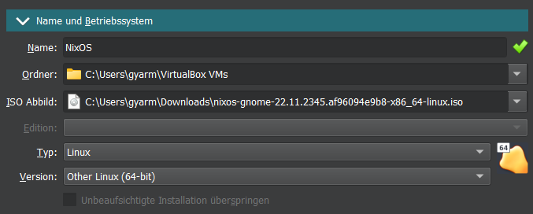
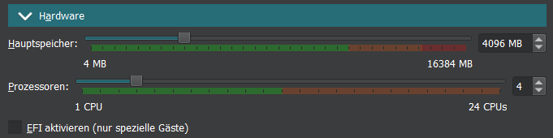
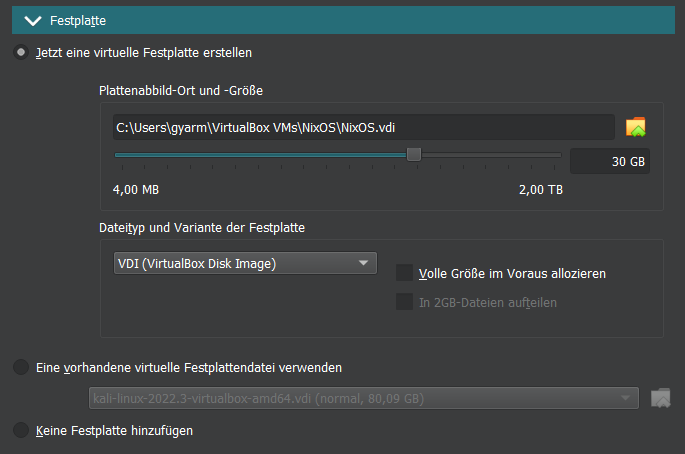
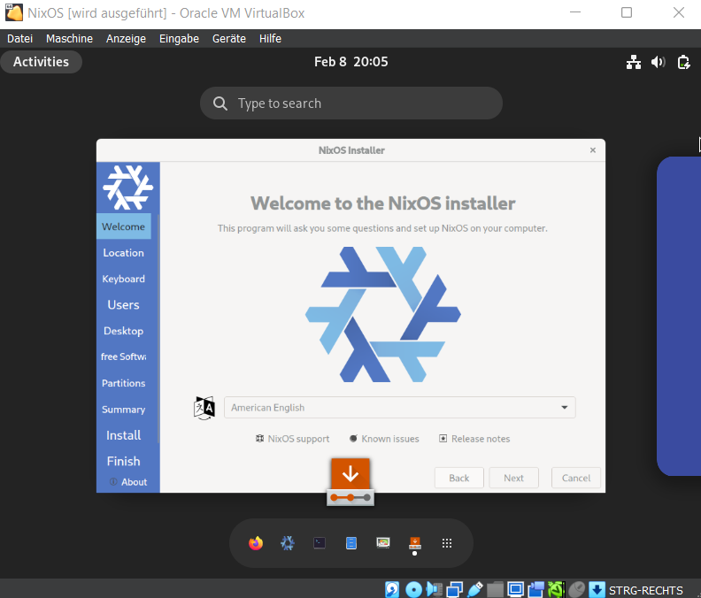
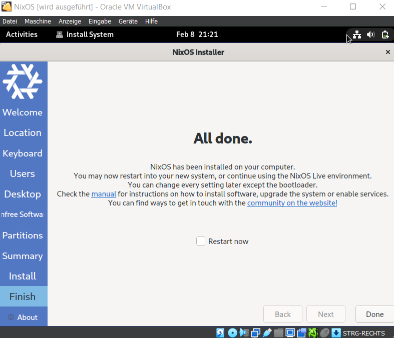

# Distro Install

### 4.

## a)

### i.

**Name:** NixOS

[DistroWatch.com: NixOS](https://distrowatch.com/table.php?distribution=nixos)

[Distribution Release: NixOS 22.11 (DistroWatch.com News)](https://distrowatch.com/?newsid=11696)

### ii.

Ich habe es nur wegen dem Namen gewählt. Ich fand es lustig und wollte wissen wie es aussieht.

## b)

**Installationserfahrung:**

## c)

**Screenshots:**

