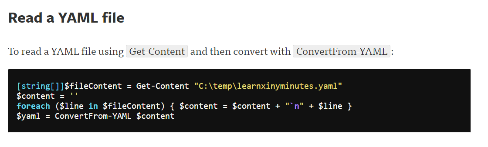
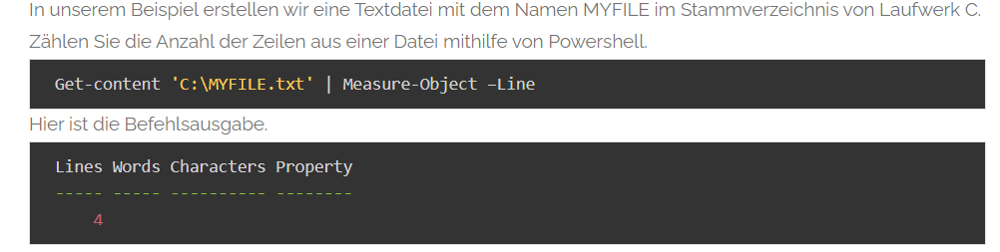
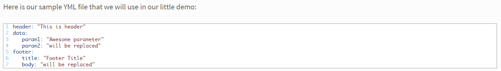
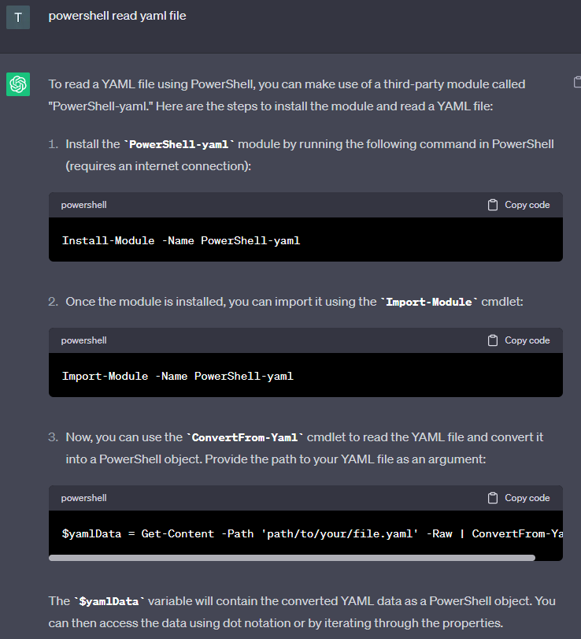
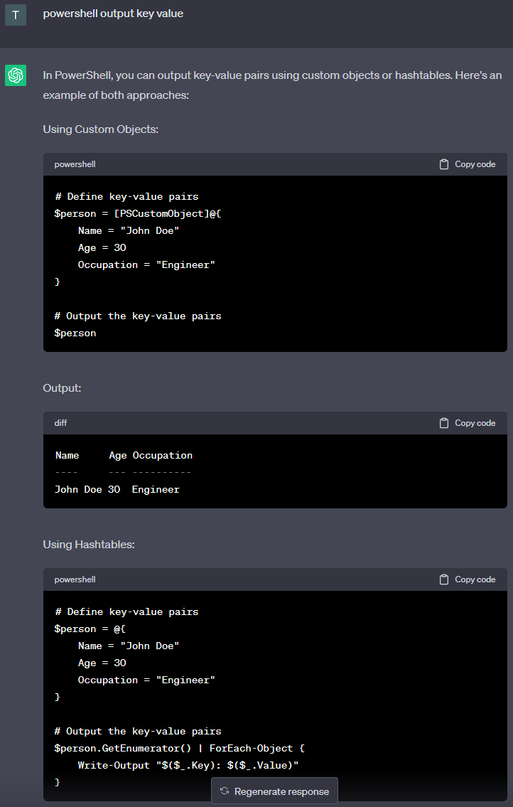
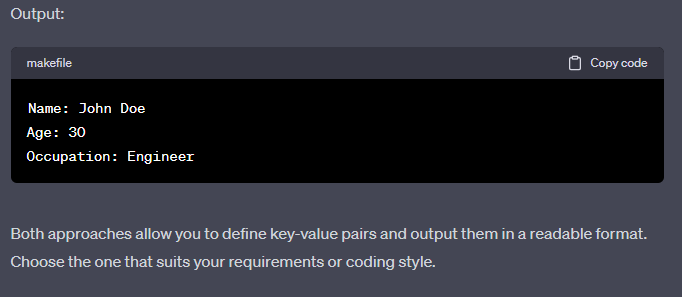
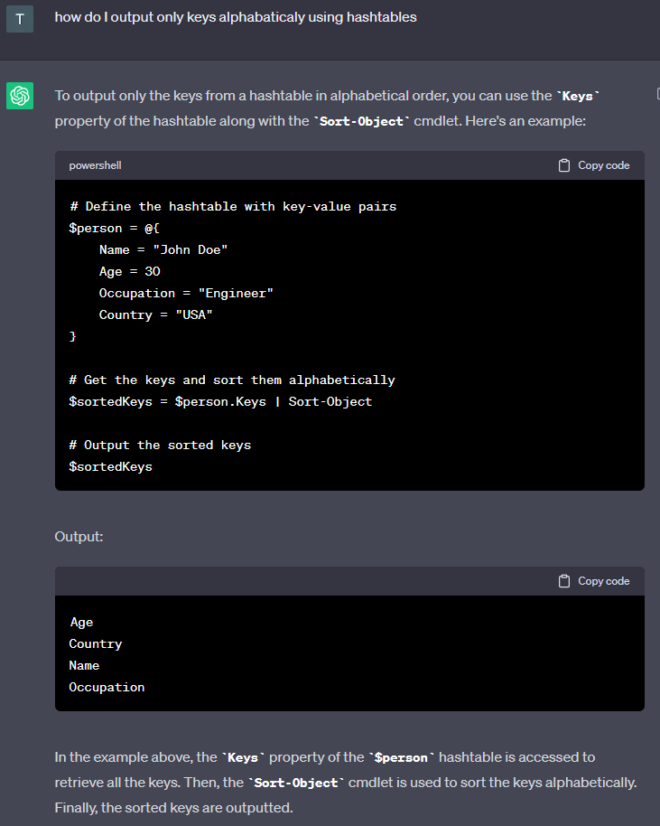
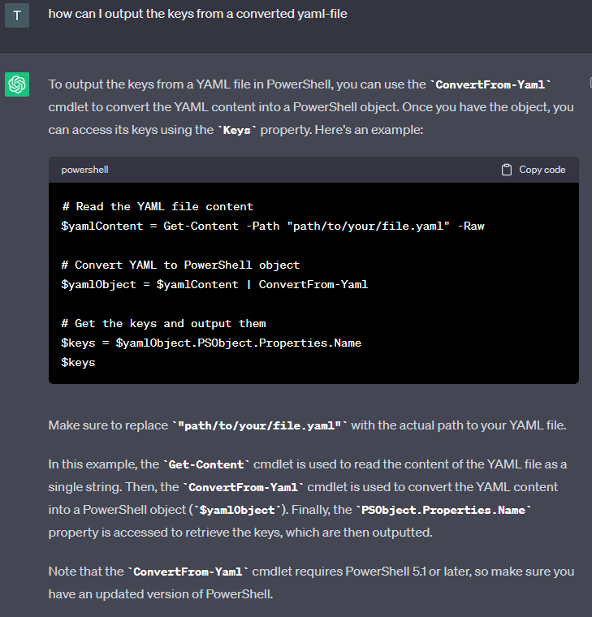

## Websites I used/found useful for this excercise

http://dbadailystuff.com/a-brief-introduction-to-yaml-in-powershell

https://techexpert.tips/de/powershell-de/powershell-zaehlen-von-zeilen-aus-einer-datei/

https://mjc.si/2020/10/08/modify-yml-files-with-powershell/

## Questions I asked and answers I received from Chat GPT for this excercise

